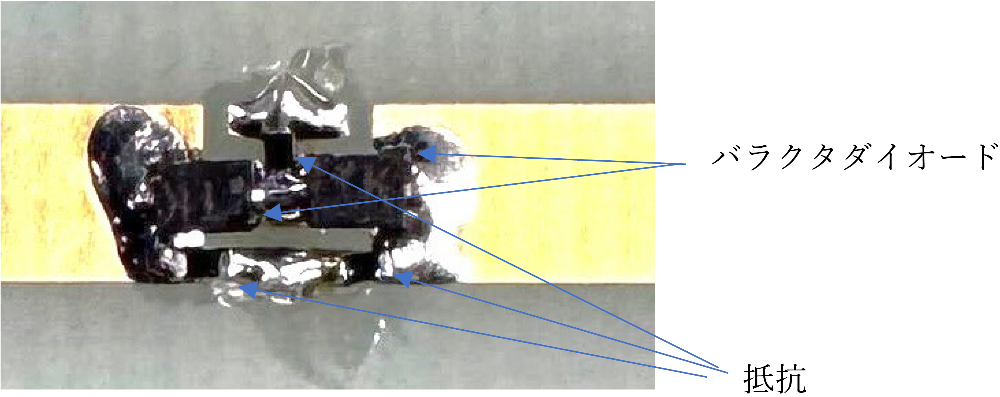

# irs-tools

## 1. IRSとは


入射波がIRSに当たるとIRSは反射波の方向やビームの形状などを任意に制御することが出来る。このことにより、電波を用いた無線電力伝送の効率向上や無線通信に於ける通信可能エリアの拡大などを実現する。

## 2. 製作するIRSの検討
1. 周波数は2.4GHz帯にする。
   - ミリ波(準ミリ波: 20～30GHz)帯の通信エリア拡大の為に、5G（6G）通信で必要性が増しているが、この周波数帯域の電子回路やアンテナなどの製作は微細な加工精度が要求され非常に高価になる。測定器やケーブルなども非常に高価であり大学の一研究室では対応困難である。
   - 2.4GHz帯は、市販の部品が豊富に存在するとともに、一般的なプリント基板の加工精度で十分であるとともに、測定器やケーブルなども比較的安価であり、既に研究室で保有している。
   - 2.4GHz帯でも電波による無線電力伝送や微弱な電波を用いた通信、Backscatter通信などIRSが必要とされる用途が多くある。

2. IRSの寸法はプリント基板製造メーカP版.comの制約から300㎜×300㎜にする。
   - ビームフォーミングのためにアンテナ素子を1/2λ間隔で配置する。2.4GHzでのλは約12㎝であるため素子数は5列×5行=25個である。

3. IRS素子はダイポールアンテナをバラクタダイオードで制御する方式にする。
   - ダイポールアンテナはGND板が不要であり、バラクタダイオードの接続するための配線のアンテナ性能への影響が少ないため、これを採用することに決定した。
   - モノポールアンテナは、広いGND板が必要であり、プリント基板上に多数の素子を平面的に配置するのが難しい。
   - パッチアンテナは、アンテナ素子の裏面に広いGND板が必要であり、GND板との距離が短いと帯域が狭くなる。2.4GHz帯の帯域をカバーするアンテナを安価な1.6㎜厚位のガラスエポキシ基板で製作するのは難しいと考えた。

## 3. IRSの設計
1. IRS素子


ダイポールアンテナのアンテナ素子の間にバラクタダイオード2個を直列に配置し、バラクタダイオードのカソード側は抵抗を介してGNDに接続、アノード側は抵抗を介してバラクタ電圧を供給する。


低いバラクタ電圧ではバラクタダイオードの容量が大きくなるため、IRS素子の電気長が長くなり八木・宇田アンテナの反射器として動作し、中間的なバラクタ電圧では電波の波長に同調して吸収器として動作する。高いバラクタ電圧では、バラクタダイオードの容量が小さくなり八木・宇田アンテナの反射器として動作する。バラクタダイオードを直列接続にした理由は、最低容量が0.5pF以下で容量変化比が10倍以上でESRが低いダイオードが無いからである。具体的にはTOSHIBA 1SV287、最低容量0.6pF、容量変化比10倍（0V/20V）、ESR1.9Ωを採用した。
1. ダイポールアンテナを素子としたIRSの動作


IRS素子から1/2λ離れた位置にGND板を配置して、電波を反射する（反射器）に設定すると電波はIRS素子で反射する。電波を通過する（導波器）に設定すると、反射した電波の位相に対して通過した電波の位相はGND板に反射して180度ずれた位相になる。多数あるIRS素子をそれぞれ反射又は通過に制御することにより合成された反射波のビームを任意に制御することが出来る。IRS素子を吸収器に設定したときは、バラクタ電圧により反射器と吸収器の中間的な特性や吸収器と導波器の中間的な特性になり、0～180度の位相が得られる。
1. バラクタ電圧の制御


IRS素子1素子に対して、DAコンバータ2個により2種類の電圧を発生し、その電圧をアナログスイッチにより切り替えてバラクタ電圧を供給する。
1. バックスキャッタ変調


完成したIRSの評価を行うとき、IRSの反射波のみの測定が出来れば、IRSの性能把握が容易に行えると考えバックスキャッタ変調機能を設けた。バラクタ電圧の制御の切替信号を切り替えるとIRSの反射波が搬送波の周波数±Δfの周波数で変調されバックスキャッタ変調波が発生する。このバックスキャッタ変調波のレベルを測定すれば反射波成分の強さを知ることが出来る。
1. 全体の制御


パソコンとUSB_I/Fで接続し、電源はUSBから供給する。USB_I/Fにはパソコンと500Kバイト/秒位で通信可能なUSB_FIFO ICであるFT245RLを使用する。マイクロコンピュータにSTM32F446REを用いてバラクタ電圧発生回路のDACの制御とバラクタ電圧の切替信号を発生する。

## 4. IRS素子のシミュレーション
無償の2.5次元電磁界シミュレータであるSonnet Liteを用いて素子のシミュレーションを行った。
1. IRS素子のモデル


IRS素子のモデルは1.6㎜厚のガラスエポキシ基板上に35μm厚の銅箔パターン21.25㎜×3㎜を外側左右に配置し、さらにバラクタダイオードと抵抗を意識した1.5㎜×1㎜を内側左右に配置する。0.5㎜×0.5㎜のビアをIRS素子の直近から底面GNDまで伸ばしてIRS制御回路基板とバラクタダイオードに供給するバラクタ電圧を結ぶケーブルをモデルする。
2. IRS全体のモデル（`Dipole1_A9_0.5.son`）


Sonnet Lite の限界からIRS素子9個を1/2λ間隔で配置してモデルを作成した。モデルの中央に配置した素子のコンデンサの容量を変化させてシミュレーションを行った。
    - 容量無しのIRS素子のS11（リターンロス）特性（C=0pF）
    
    
    
    リターンロスが-10dB（VSWR≒2.0）以下の帯域が350MHzであり、一般的なダイポールアンテナと同等の性能
    - 容量を付加したIRS素子のS11(リターンロス)特性
    
    
    
    
    
    C=0.4PからC=0.7Pまで中心周波数が上がり、C=1.0P、C=1.2Pと容量が増えると中心周波数が下がっている。C=0.4PからC=0.7Pで中心周波数が上がっているが、リターンロス-48.5dB～-13.6dBと微小な値の範囲の変化である。シミュレータのメッシュ生成の状況により変化する。容量が小さいと中心周波数が上がり、大きいと下がる傾向にある。

## 5. 設計データ
1. IRS素子基板


無償のプリント基板設計CADである「CADLUS X」を用いて基板パターンを設計する。設計データファイルは`IRS_DIPOLE_1.COMP`。このファイルをP板.comなどに渡して製造を依頼できる。
2. IRS制御回路基板


接続図を`IRS_Cont_SCHEME.pdf`ファイルに示す。無償のプリント基板設計CADである「CADLUS X」を用いて基板パターンを設計する。設計データファイルは`IRS_CONT1_B.COMP`。このファイルをP板.comなどに渡して製造を依頼できる。諸元表を`IRS_PartsList.xlsx`ファイルに示す。

## 6. 組立
1. IRS素子基板の25個のIRS素子にバラクタダイオード（1SV287）2個と5KΩ（1005サイズ）の抵抗3個をはんだ付けする。



2. IRS制御基板に部品を取り付けます。
3. IRS素子基板とIRS制御基板をジャンパー線で接続する。ジャンパー線には、株式会社潤工社製のジュンフロンETFE電線AWG30番を使用する。先ず、IRS素子基板に両端被覆を剥がした線をはんだ付けし、次にIRS制御基板のスルーホール（CN401〜CN402）に線を通してはんだ付けする。


## 7. ファームウェア
IRS制御基板に搭載のマイクロコンピュータ（STM32F446RE）のファームウエアは無償のクラウド型開発環境であるMbedを使用して開発する。Keil Studioにログインして、Mbed OS 5でプロジェクトを作成し、`IRS_Cont1.tar`ファイルのアーカイブを解凍し、解凍したファイルをプロジェクトにアップロードしてBuild targetをNUCLEO F446REにしてコンパイルすれば`XXX.bin`ファイルをが生成される。この`XXX.bin`ファイルをNUCLEO F446REボード等のST-LINKをIRS制御基板のCN101に接続して、RS制御基板に搭載のマイクロコンピュータ（STM32F446RE）のフラッシュメモリに書き込む。IRS制御基板のUSB I/Fをパソコンに接続してTeraterm等のハイパーターミナルを用いて`h` `Enter`を入力すると以下のHelpが表示される。
```
-----------------------------------------------------------------------------------
vaa float           DAC A チャネル1～25  同一電圧設定 V=0～20.5
vba float           DAC B チャネル1～25  同一電圧設定 V=0～20.5
vas float……float    DAC A チャネル1～25  指定電圧設定 V=0～20.5
vbs float……float    DAC B チャネル1～25  指定電圧設定 V=0～20.5
sw  int             スイッチング (1500 / 2～250)kHz
-----------------------------------------------------------------------------------
```
1. `vaa`コマンド
浮動小数点形式数値（0〜20.5）の電圧にAチャネルのDAC 25個を設定する。この時バラクタ電圧はAチャネルの電圧が選択される。
2. `vba`コマンド
浮動小数点形式数値（0〜20.5）の電圧にBチャネルのDAC 25個を設定する。この時バラクタ電圧はBチャネルの電圧が選択される。
3. `vas`コマンド
チャネル1～25の電圧をそれぞれ浮動小数点形式数値（0〜20.5）で指定された電圧に設定する。この時バラクタ電圧はAチャネルの電圧が選択される。
4. `vbs`コマンド
チャネル1～25の電圧をそれぞれ浮動小数点形式数値（0〜20.5）で指定された電圧に設定する。この時バラクタ電圧はBチャネルの電圧が選択される。
5. `sw`コマンド
（1500÷デバイド値）KHzの周波数でAチャネルの電圧とBチャネルの電圧を切り替えてバラクタ電圧を出力する。動作中に任意の文字を入力すると切替が止まる。

## 8. 測定環境
- IRS装置


- 信号源（LAUNCHXL-CC1352P）


- 受信機（PlutoSDR)


信号源としてTexas Instruments Inc.製LAUNCHXL-CC1352P、受信機としてAnalog Devices製PultoSDRを使用する。LAUNCHXL-CC1352Pから電波を発射して、IRS装置からの反射成分をバックスキャッタ変調させて反射波のみを測定、又は、バックスキャッタ変調せずに直接波と反射波の合成を測定する。LAUNCHXL-CC1352Pについては、https://github.com/watalabo/backscatter-tools の「1.2 簡易シグナルジェネレータ」を参照されたい。PlutoSDRはGNU Radioで制御する。


PlutoSDR SourceでPultoSDR装置の設定を行う。バックスキャッタ変調無しの場合はLO Frequencyを2440MHzに設定し、例えば500KHzでバックスキャッタ変調を行った場合は2440.5又は2439.5MHzに設定する。RSSI Writeで、`rssi.txt`ファイルに10サンプル/秒以上の頻度でRSSIを書き込む。このファイルの内容をIRSの制御など他のプログラムが読み込み使用する。このGNU Radioでは受信IQのコンスタレーション、受信位相、RSSIをグラフィック表示する。GNU Radioの設定を`untitled.py`ファイルに示す。

## 9. 測定結果
### 9.1 バックスキャッタ変調時の特性の測定
- 信号源から2440MHzの電波を発射。
- 25個の素子のAチャネルの電圧0〜20V（VaractorA）、Bチャネルの電圧0〜20V（VaractorB）をグラフに示す様に変化させ500KHzで切り替えている。
- SDRを用いて2440.5MHzのバックスキャッタ変調された反射波を測定する。

以上の条件で測定した結果を示す。

- バラクタ電圧の変化


- RSSIの測定結果


- グラフの左端と右端の付近では、バラクタ電圧が0Vと20Vの変化の時に大きなRSSIが得られている。バラクタ電圧が0Vの時にIRS素子が反射器になり、バラクタ電圧が20Vの時に導波器になっている様子がうかがえる。
- グラフの中央付近では、10V付近と20V又は0Vと10V付近の時に大きなRSSIが得られている。バラクタ電圧が10Vの時に吸収器、0Vの時に反射器、20Vの時に導波器として動作している。吸収器により電波が吸収されるので4dB位レベルがダウンしている。

### 9.2 IRSの反射波のビームパターンの測定
シールドテントの中で、上部にIRS装置、下部にガントリーロボット、ガントリーロボットに受信アンテナを取り付けています。


測定手順
1. 送信アンテナから2440MHzの電波を発射する。
2. ガントリーロボットをX軸3㎝×8、Y軸3㎝×8の位置に移動する。
3. 全素子のAチャネルの電圧を20V、Bチャネルの電圧を0に設定する。
4. 素子1のAチャネルの電圧を8段階×Bチャネルの電圧を8段階変化させ、500KHzで電圧を切り替えてバックスキャッタ変調させる。バックスキャッタ変調された電波を受信してRSSIが最も大きかったAチャネルとBチャネルの電圧に設定する。（8段階の電圧は0、2、4、6、8、10、15、20V）
5. 素子2～24について同様に4を行う。
6. ガントリーロボットで受信アンテナを（横方向X：3㎝×17位置）×（縦方向方向Y：3㎝×17位置）に移動させてRSSIを測定する。

ビーム形成結果を以下の2種類のグラフに示す。ほぼ狙った位置にビームが形成できている。


### 9.3 直接波を含むビームパターンの測定
「9.2 IRSの反射波のビームパターンの測定」と同じ環境で測定する。

測定手順
1. 送信アンテナから2440MHzの電波を発射する。
2. ガントリーロボットを指定位置に移動する。
3. 全素子のAチャネルの電圧（=バラクタ電圧）を0Vに設定する。
4. 素子1のAチャネルの電圧を8段階変化させ、RSSIが最も大きかったAチャネルの電圧に設定する。（8段階の電圧は0、2、4、6、8、10、15、20V）
5. 素子2～24について同様に4を行う。
6. ガントリーロボットで受信アンテナを（横方向X：3㎝×17位置）×（縦方向方向Y：3㎝×17位置）に移動させてRSSIを測定する。

測定結果
- 「横方向X：6㎝×9位置」、「縦方向方向Y：6㎝×9位置」=81位置でビーム形成を行い、ビーム形成前とビーム形成後の各位置でのRSSIの変化を測定した。
- 初期は、ビーム形成前のRSSI、CALはビーム形成後のRSSI。
- 改善出来た位置は75/81。(初期状態で低いRSSIが得られていた位置が、改善効果が大きい。最大11.5dB)
- 改善出来なかった位置は6/81だが、差が最大1.1dBであり悪化は殆ど無いと言える。(この位置は、初期状態で高いRSSIが得られていた位置である)
- 3dB(電力が倍)以上改善(電力が倍)出来た位置は41/81。
- 81位置での差の平均は3.03dB。

