# irs-tools

## 1. What is an IRS?


When an incident wave impinges on the IRS, the IRS can arbitrarily control the direction and beam shape of the reflected wave. This enables improvements in the efficiency of wireless power transfer using radio waves and the expansion of communication coverage areas in wireless communication systems.

## 2. Design Considerations for the IRS

1. The operating frequency is set to the 2.4 GHz band.
   - Although the need for IRSs in 5G and 6G communication systems has increased due to their potential to expand the coverage area of millimeter-wave (20–30 GHz) communication, electronic circuits and antennas in this frequency band require extremely high manufacturing precision, making them prohibitively expensive. Test equipment and cables are also costly, making it difficult for a typical university laboratory to handle.
   - The 2.4 GHz band offers a wide availability of commercial components, and standard PCB fabrication precision is sufficient. Test equipment and cables are relatively inexpensive, and our laboratory already possesses the necessary equipment.
   - Even in the 2.4 GHz band, there are many applications where IRSs are needed, such as wireless power transfer, low-power communication, and backscatter communication.

2. The IRS dimensions are set to 300 mm × 300 mm based on the manufacturing constraints of the PCB vendor P-ban.com.
   - To enable beamforming, antenna elements are placed at half-wavelength (λ/2) intervals. Since the wavelength at 2.4 GHz is approximately 12 cm, the total number of elements is 5 × 5 = 25.

3. Each IRS element consists of a dipole antenna controlled by varactor diodes.
   - Dipole antennas do not require a ground plane and are less affected by the wiring required to connect varactor diodes. Therefore, this design was adopted.
   - Monopole antennas require a large ground plane and are difficult to arrange in large numbers on a planar PCB.
   - Patch antennas require a large ground plane on the reverse side of the element, and their bandwidth narrows when the ground plane is close to the element. It is challenging to fabricate patch antennas that cover the 2.4 GHz band using low-cost 1.6 mm thick FR-4 substrate.

## 3. IRS Design

1. IRS Elements

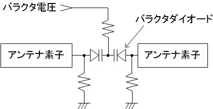

Two varactor diodes are connected in series between the dipole antenna arms. The cathode side is connected to ground through a resistor, and the anode side is supplied with varactor bias voltage through another resistor.

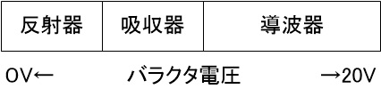

When the varactor voltage is low, the varactor capacitance increases, effectively lengthening the electrical length of the IRS element, causing it to function as a reflector in a Yagi-Uda configuration. At intermediate voltages, it resonates with the incident wavelength, functioning as an absorber. At high voltages, the varactor capacitance decreases, and the element again functions as a reflector. The varactors are connected in series because it is difficult to find diodes with minimum capacitance below 0.5 pF, capacitance ratio above 10, and low ESR. Specifically, we adopt the TOSHIBA 1SV287 (Cmin = 0.6 pF, capacitance ratio = 10 at 0V/20V, ESR = 1.9 Ω).

2. IRS Operation Using Dipole Antennas


A ground plane is placed at a distance of λ/2 from the IRS element. When the element is configured as a reflector, the wave is reflected directly. When configured as a director, the wave passes through the element and reflects from the ground plane, introducing a 180-degree phase shift. By individually configuring each element as a reflector or director, the overall reflected beam can be controlled arbitrarily. When set as an absorber, the element exhibits intermediate characteristics between reflector and director, achieving a phase shift range of 0–180 degrees depending on the varactor voltage.

3. Control of Varactor Voltage


Each IRS element is driven by two DACs generating two voltages, which are alternately selected using an analog switch to apply the desired varactor voltage.

4. Backscatter Modulation

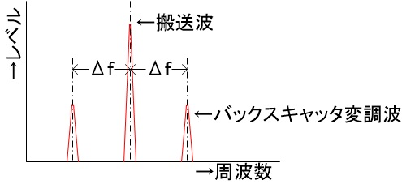

To facilitate evaluation of the IRS, a backscatter modulation function was implemented to isolate the reflected wave. When the control signal switches the varactor voltage, the reflected wave is modulated to frequencies ±Δf from the carrier frequency. Measuring the level of the backscattered signal reveals the strength of the reflected component.

5. Overall Control System


The system interfaces with a PC via USB, with power also supplied via USB. The USB interface uses an FT245RL USB FIFO IC for communication at around 500 KB/s. An STM32F446RE microcontroller generates the DAC control signals and switching control for the varactor voltages.

## 4. Simulation of IRS Elements

The simulation was performed using the free 2.5D electromagnetic field simulator Sonnet Lite.

1. Model of an IRS Element


The IRS element consists of a 35 μm copper pattern (21.25 mm × 3 mm) on the edges of a 1.6 mm thick FR-4 substrate. Internal structures (1.5 mm × 1 mm) mimic the varactor diode and resistors. A 0.5 mm × 0.5 mm via models the cable connecting the bottom GND layer to the varactor supply.

2. Full IRS Model (`Dipole1_A9_0.5.son`)

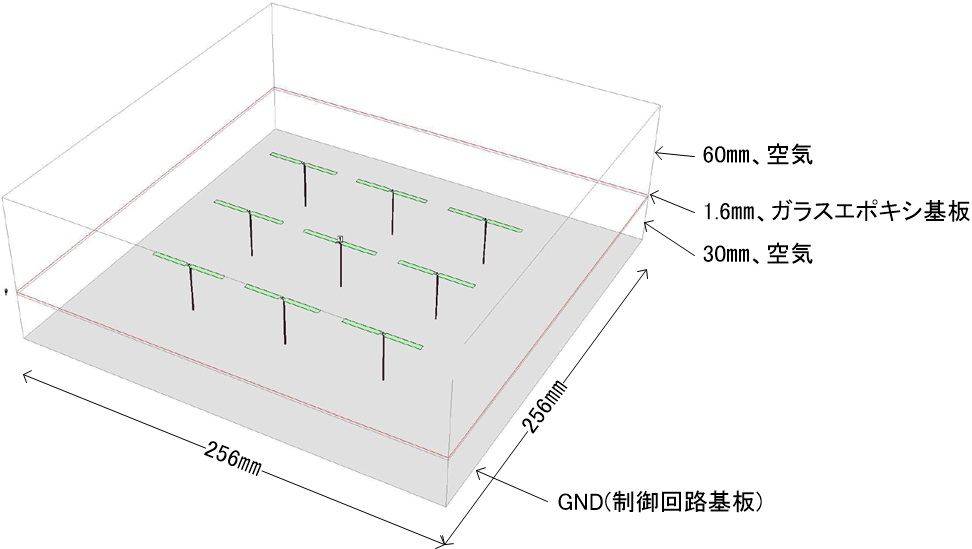

Due to limitations in Sonnet Lite, a model with 9 elements spaced λ/2 apart was created. The central element's capacitance was varied for simulation.
   - S11 (return loss) with no capacitance (C = 0 pF)

   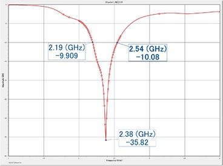

   Bandwidth with S11 < -10 dB (VSWR ≈ 2.0) is 350 MHz, comparable to standard dipole antennas.
   - S11 with varying capacitance

      
   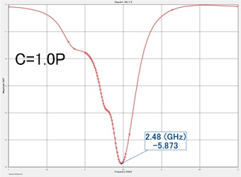 

   As capacitance increases from C=0.4 pF to C=1.2 pF, the center frequency shifts downward. Center frequency rises slightly from C=0.4 pF to C=0.7 pF, but this variation may be due to meshing artifacts. Overall, lower capacitance results in higher resonance frequency.

## 5. Design Data

1. IRS Element PCB


Designed using the free PCB CAD tool "CADLUS X." The design file `IRS_DIPOLE_1.COMP` can be sent to manufacturers such as P-ban.com for fabrication.

2. IRS Control PCB


The schematic is provided in `IRS_Cont_SCHEME.pdf`. The design was also created using "CADLUS X." The file `IRS_CONT1_B.COMP` can be used for manufacturing. A parts list is included in `IRS_PartsList.xlsx`.

## 6. Assembly

1. Each of the 25 elements on the IRS element board is soldered with two 1SV287 varactor diodes and three 5 kΩ resistors (1005 size).


2. Components are mounted on the IRS control board.

3. The IRS element and control boards are connected using jumper wires (AWG30 ETFE wire from Junkosha Co., Ltd.). First, solder the wires to the element board, then insert them into through-holes (CN401–CN402) on the control board and solder.

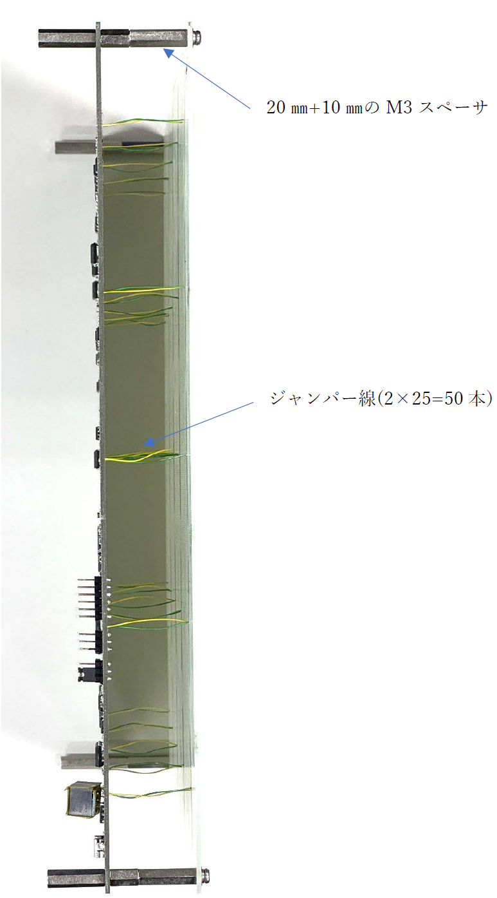

## 7. Firmware

The microcontroller (STM32F446RE) firmware is developed using the free cloud-based Mbed environment. After logging in to Keil Studio and creating a project with Mbed OS 5, extract the archive `IRS_Cont1.tar` and upload the files to the project. Set the build target to NUCLEO F446RE to compile and generate a `XXX.bin` file. Use ST-LINK to write this file to the microcontroller’s flash memory. Connect the USB interface to a PC, and input `h` + `Enter` on a terminal (e.g., Teraterm) to display the help menu:
```
-----------------------------------------------------------------------------------
vaa float           DAC A チャネル1～25  同一電圧設定 V=0～20.5
vba float           DAC B チャネル1～25  同一電圧設定 V=0～20.5
vas float……float    DAC A チャネル1～25  指定電圧設定 V=0～20.5
vbs float……float    DAC B チャネル1～25  指定電圧設定 V=0～20.5
sw  int             スイッチング (1500 / 2～250)kHz
-----------------------------------------------------------------------------------
```
1. `vaa` Command  
Sets all 25 DACs of channel A to the same voltage specified in floating-point format (range: 0–20.5 V). The varactor voltage is derived from the A channel in this configuration.

2. `vba` Command  
Sets all 25 DACs of channel B to the same voltage specified in floating-point format (range: 0–20.5 V). The varactor voltage is derived from the B channel in this configuration.

3. `vas` Command  
Sets the voltages of DACs for channels 1 to 25 individually to values specified in floating-point format (range: 0–20.5 V). In this case, the varactor voltage is selected from the A channel.

4. `vbs` Command  
Sets the voltages of DACs for channels 1 to 25 individually to values specified in floating-point format (range: 0–20.5 V). In this case, the varactor voltage is selected from the B channel.

5. `sw` Command  
Alternates the varactor voltage output by switching between A and B channel voltages at a frequency of (1500 ÷ divider value) kHz. Inputting any character during operation terminates the switching.

## 8. Measurement Environment

- IRS Device

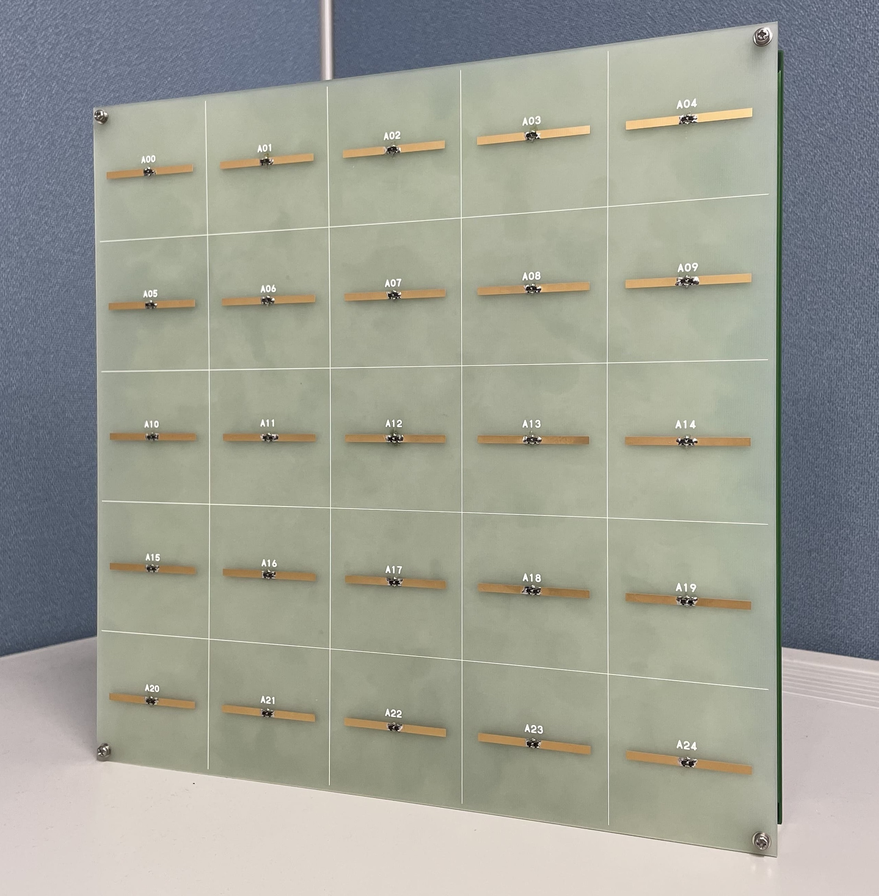

- Signal Source (LAUNCHXL-CC1352P)

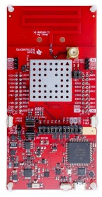

- Receiver (PlutoSDR)


The signal source is TI’s LAUNCHXL-CC1352P and the receiver is Analog Devices’ PlutoSDR. The source emits a radio signal, and the IRS-modulated reflection is measured via backscatter or as a superposition with the direct wave. For LAUNCHXL-CC1352P details, refer to: https://github.com/watalabo/backscatter-tools (section 1.2 "Simple Signal Generator"). PlutoSDR is controlled via GNU Radio.

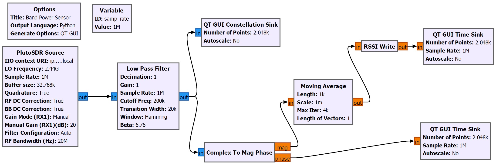

PlutoSDR Source sets parameters for PlutoSDR. For unmodulated measurements, set LO to 2440 MHz. For 500 kHz backscatter modulation, set it to 2440.5 or 2439.5 MHz. RSSI is written to `rssi.txt` at ≥10 samples/sec for use in other programs. Constellation, phase, and RSSI are also visualized. Configuration is in `untitled.py`.

## 9. Measurement Results

### 9.1 Backscatter Modulation Characteristics

- A 2440 MHz wave is transmitted.
- A and B channel voltages are varied between 0–20 V and switched at 500 kHz.
- The backscattered wave at 2440.5 MHz is measured via SDR.

- Varactor voltage variation:


- RSSI measurement result:


- High RSSI is observed when the varactor voltage switches between 0V (reflector mode) and 20V (director mode).
- In the center region, high RSSI is observed when switching between absorber (10V) and reflector or director modes. The absorber reduces signal power by ~4 dB.

### 9.2 IRS Beam Pattern Measurement

Inside a shielded tent, the IRS device is placed above a gantry robot that moves a receiving antenna.


Measurement procedure:
1. Transmit 2440 MHz signal.
2. Move gantry in 3 cm × 8 positions (X, Y).
3. Set all A-channel voltages to 20V and B-channel to 0V.
4. For each element (1–24), scan 8 × 8 combinations of A and B voltages (0, 2, ..., 20V), and select the pair that maximizes RSSI at 500 kHz switching.
5. Measure RSSI over 3 cm × 17 (X) × 17 (Y) grid.

Results show effective beamforming:

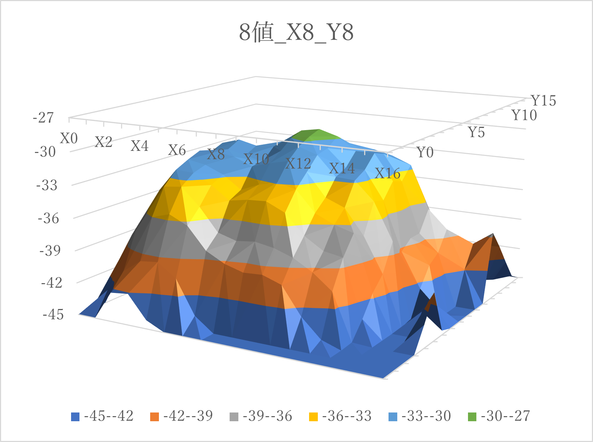  
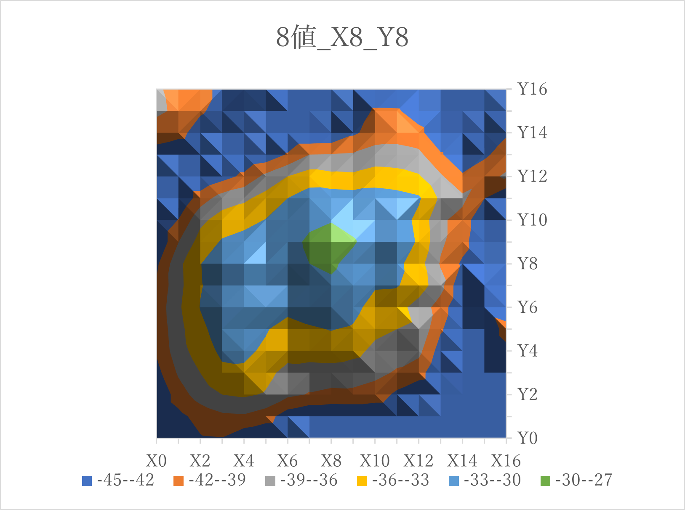

### 9.3 Beam Pattern Including Direct Wave

Same setup as 9.2.

Procedure:
1. Transmit 2440 MHz.
2. Move gantry to target position.
3. Set all A-channel voltages to 0V.
4. For each element (1–24), scan 8 voltage steps and select one with highest RSSI.
5. Measure RSSI over 17×17 positions.

Results:
- Beamforming improved RSSI in 75/81 positions (max gain: 11.5 dB).
- Only 6/81 positions worsened, with a max degradation of 1.1 dB.
- >3 dB improvement in 41/81 positions.
- Average improvement: 3.03 dB.


